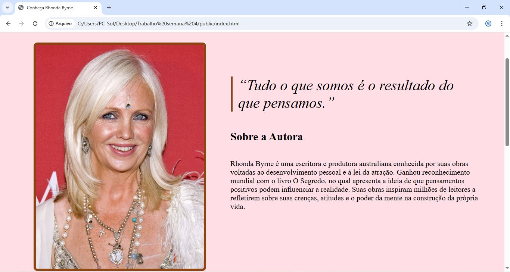
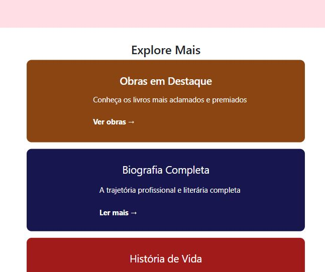

# Site Responsivo - Rhonda Byrne

Projeto front-end desenvolvido como atividade acadêmica com foco em responsividade e adaptação de layouts para diferentes tamanhos de tela.

O projeto foi inspirado na autora Rhonda Byrne e teve como objetivo praticar conceitos de desenvolvimento web utilizando HTML e CSS, com ênfase em responsividade e experiência do usuário em dispositivos móveis e desktops.

---

## Tecnologias Utilizadas

- HTML
- CSS
- Media Queries

---

## Funcionalidades

- Layout responsivo para diferentes resoluções
- Organização visual adaptada para dispositivos móveis
- Estruturação semântica básica em HTML
- Ajuste de elementos para melhor experiência do usuário

---

## Objetivo do Projeto

Este projeto foi desenvolvido para aplicar conceitos de:

- Responsividade
- Estruturação de páginas web
- Organização de layout
- Adaptação de interface para múltiplos dispositivos

---

## Aprendizados

Durante o desenvolvimento deste projeto, foram praticados conceitos importantes como:

- uso de media queries;
- adaptação de layouts responsivos;
- alinhamento e organização de elementos;
- melhoria da experiência visual em diferentes telas.

---

## Print da página para Desktop:

## Print da página para Mobile:

## Autor

Victor Fernandes dos Santos